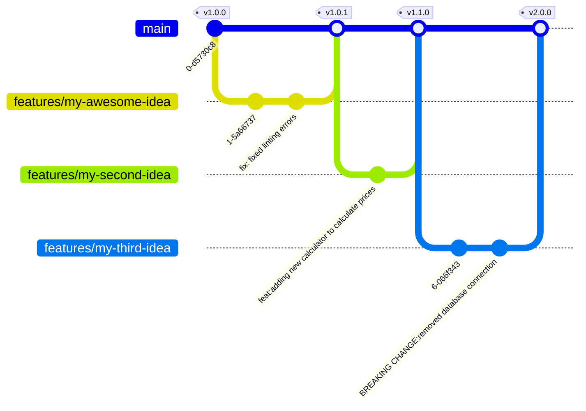

# 📦🚀 GitHub Action release drafter

[](https://github.com/KoblerS/release-drafter/actions/workflows/publish.yml)

Draft GitHub releases and automate versioning based on
[conventional commit messages](https://www.conventionalcommits.org).

Here is a git graph, demonstrating how the release strategy would look like:



## Usage

```yaml
- uses: KoblerS/release-drafter@v1
```

The available parameters are optional:

- `token`: (default) the GitHub token that will be used for authentication
- `generate-release-notes`: `true` (default) adds the existing commit messages
  to the release notes, `false` leaves the release notes empty
- `version-prefix`: `v` prepends a prefix to the version number

> [!IMPORTANT]  
> Important note: Make sure to set the correct permissions for your action:

```yaml
permissions:
  # Required to request the OIDC JWT Token
  id-token: write
  # Required when GH token is used to authenticate with private repo
  contents: write
```

## Output variables

In order to continue workflow code the following output parameters are set:

- `release-id`: GitHub internal id of the created release
- `version`: Version code of the created release
- `raw-version`: Version code without `v` prefix

## How does it work?

This action analyzes commit messages to assess the impact of changes on the codebase. By adhering to standardized commit message conventions, it automatically calculates the next [semantic version](https://semver.org/) number, generates a changelog, and drafts a release on GitHub.

Tools like [commitizen](https://github.com/commitizen/cz-cli) or [commitlint](https://github.com/conventional-changelog/commitlint) can assist contributors in creating valid commit messages.

The examples below illustrate which commit messages trigger specific release types when semantic-release is executed (using the default configuration):

### Patch release

- `fix(api): fixed API endpoint to get the communication working`
- `docs: added infrastructure diagram`
- `test: added unit tests for src/calculator.ts`

For a comprehensive list of keywords, refer to [src/version-helper.ts](src/version-helper.ts).

### Minor release

- `feat(calculation): implemented salary income calculator`

### Major release

Ensure the `BREAKING CHANGE:` token is at the beginning of the line.

- `perf(pencil): remove graphiteWidth option`
  - `BREAKING CHANGE: The graphiteWidth option has been removed.`
  - `The default graphite width of 10mm is always used for performance reasons.`
- `refactor!: refactored API endpoints to noun-based approach`
- `major: enforcing OAuth authentication for all API endpoints`
